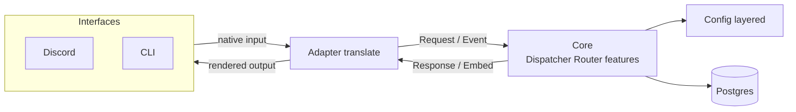

# MasarykEx

A modular Discord bot built on a **ports-and-adapters** core: the bot's features
know nothing about Discord. Discord is just one *interface* (adapter) that feeds a
neutral core; a CLI is another, and a web UI could be a third. Features
(commands and services) are auto-discovered — drop a file in the right folder,
implement a small behaviour, and it registers itself on boot.

## Architecture



The core never references Nostrum. Each adapter owns *all*
of its interface-specific code and translates to/from the neutral core types.

| Direction | Neutral type | Where Discord lives |
|---|---|---|
| Inbound command | `MasarykEx.Core.Request` | `Adapters.Discord.Translate.to_request/1` |
| Inbound event | `MasarykEx.Core.Event` | `Adapters.Discord.Translate.to_event/2` |
| Outbound result | `MasarykEx.Core.Response` (+ `Core.Embed`) | `Adapters.Discord.Translate.to_discord_response/1` |

### Directory layout

```
lib/masaryk_ex/
  core/                 # interface-neutral contracts + types (no Discord)
    request.ex          # %Request{command, args, context}
    response.ex         # %Response{content, ephemeral, embed}
    embed.ex            # %Embed{title, description, color, footer, fields}
    context.ex          # %Context{interface, user_id, guild_id, channel_id}
    event.ex            # %Event{type, data, context}
    command.ex          # behaviour: definition/0, run/1, (opt) config_schema/0
    service.ex          # behaviour: handle_event/2, (opt) child_spec/1, config_schema/0
    dispatcher.ex       # routes a Request to a command, enforces `enabled`
    router.ex           # fans an Event out to services
  config/               # per-feature config (layered, persisted)
    config.ex           # Config.get/3, Config.all/2
    store.ex            # ETS-cached, write-through store over Repo
    setting.ex          # Ecto schema for an override row
  adapters/
    discord/            # Nostrum gateway consumer + translation
    cli/                # `mix bot.run` task
  commands/             # FEATURES: user-invoked commands (auto-discovered)
    <feature>/
      definition.ex     #   MasarykEx.Commands.<Feature>.Definition (the behaviour impl)
      ...               #   optional helper modules for the feature
  services/             # FEATURES: event reactors / background work (auto-discovered)
    <feature>/
      definition.ex     #   MasarykEx.Services.<Feature>.Definition
  data/                 # data access (NOT auto-discovered) — one folder per domain
    <domain>/           #   e.g. bookmarks/: context + Ecto schema(s)
  autoloader.ex         # finds Definition modules under Commands/ and Services/
  repo.ex               # Ecto repo (Postgres)
priv/repo/migrations/   # database migrations
config/                 # config.exs, {dev,test,prod}.exs, runtime.exs
```

Each command/service lives in **its own folder** whose `definition.ex` implements
the behaviour (`MasarykEx.Commands.<Feature>.Definition`); supporting code goes in
sibling files. The roots of `commands/` and `services/` contain only feature
folders. Shared persistence/domain code lives under `data/<domain>/` and is called
directly (not discovered).

### How it works together

- **Commands** are things a user invokes. On startup the Discord adapter reads
  every command's `definition/0` and registers it as a slash or context-menu
  command; an invocation becomes a `%Request{}`, goes through
  `Core.Dispatcher`, and the returned `%Response{}` is rendered for the interface.
- **Services** react to gateway events. The Discord adapter translates each event
  into a neutral `%Event{}` and `Core.Router` fans it out to every service's
  `handle_event/2`. Services that need their own process (state, timers) also
  export `child_spec/1` and are supervised from `MasarykEx.Application`.
- **Discovery** is by namespace: `MasarykEx.Autoloader` scans compiled modules
  under `MasarykEx.Commands` / `MasarykEx.Services` for those exporting the
  behaviour callbacks (the `Definition` modules). Helper modules in the same
  folder are ignored. There is no registry to edit — add a folder and restart.

## Adding functionality

### A slash command

Create `lib/masaryk_ex/commands/<name>/definition.ex`. The folder name (kebab-case)
maps to the module (`ping-pong/` -> `MasarykEx.Commands.PingPong.Definition`).

```elixir
defmodule MasarykEx.Commands.Ping.Definition do
  use MasarykEx.Core.Command

  alias MasarykEx.Core.{Request, Response}

  @impl true
  def definition do
    %{
      name: "ping",
      description: "Replies with pong",
      args: [
        # optional; each arg: %{name, type, required, description}
        # type: :string | :integer | :boolean | :user | :number
      ]
    }
  end

  @impl true
  def run(%Request{args: _args, context: _context}) do
    Response.text("pong")
  end
end
```

Use `Response.text(content, ephemeral: true)` for a private
reply.

### A message context menu command

Set `type: :message` in the definition (no `description`/`args`). The invoked
message arrives in `args["message"]`:

```elixir
defmodule MasarykEx.Commands.Bookmark.Definition do
  use MasarykEx.Core.Command
  alias MasarykEx.Core.{Request, Response}

  @impl true
  def definition, do: %{name: "Bookmark", type: :message}

  @impl true
  def run(%Request{args: %{"message" => msg}, context: ctx}) do
    # msg => %{"id", "content", "author", "author_id", "channel_id"}
    # ctx.user_id => who invoked it
    Response.text("✔ Saved", ephemeral: true)
  end
end
```

See `lib/masaryk_ex/commands/bookmark/definition.ex` and
`commands/bookmarks/definition.ex` for a full example (they persist via the
`MasarykEx.Data.Bookmarks` domain context).

### Returning an embed

```elixir
alias MasarykEx.Core.{Response, Embed}

%Response{
  ephemeral: true,
  embed: %Embed{
    title: "Title",
    color: 0xFEE75C,
    fields: [%{name: "Name", value: "Value", inline: false}]
  }
}
```

The Discord adapter renders a real embed and the the CLI prints a text version.

### A service (reacts to events)

Create `lib/masaryk_ex/services/<name>/definition.ex`. **Passive** services just
implement `handle_event/2`:

```elixir
defmodule MasarykEx.Services.Greeter.Definition do
  use MasarykEx.Core.Service
  alias MasarykEx.Core.Event

  @impl true
  def handle_event(%Event{type: :message_created, data: data}, _config) do
    # data is a plain map, never a Nostrum struct
    :ok
  end

  def handle_event(_event, _config), do: :ok
end
```

**Active** services (own process / state) also `use GenServer` and define
`start_link/1` + `init/1` while; `use GenServer` provides `child_spec/1`, which makes
`MasarykEx.Application` start and supervise it automatically. See
`lib/masaryk_ex/services/event_logger/definition.ex` for a passive example.

Event types are neutral (e.g. `:message_created`, `:reaction_added`). To support a
new gateway event, add a clause to `Adapters.Discord.Translate.to_event/2`.

### Data access

Persistence and other shared domain logic that isn't itself a command or service
lives under `lib/masaryk_ex/data/<domain>/` — one folder per domain, holding a
context module and its Ecto schema(s), e.g. `MasarykEx.Data.Bookmarks` +
`MasarykEx.Data.Bookmarks.Bookmark`. Commands/services call these directly; they
are not auto-discovered. Add a new domain by adding a folder (and a migration
under `priv/repo/migrations/`).

### Per feature configuration

Any command or service can declare settings via `config_schema/0`:

```elixir
@impl true
def config_schema, do: %{enabled: true, restaurants: ["Padagali", "U Drevaka"]}
```

Read a setting in `run/1` or `handle_event/2`:

```elixir
MasarykEx.Config.get(__MODULE__, :restaurants, context)
```

Resolution is layered, highest priority first:

1. per-guild runtime override (when `context.guild_id` is set)
2. global runtime override
3. static value in `config/config.exs` (`config :masaryk_ex, MyModule, key: ...`)
4. the `config_schema/0` default

`enabled` is special: it defaults to `true`, and a feature with `enabled: false`
is skipped by the dispatcher/router. Runtime overrides (1 & 2) are persisted in
Postgres and editable live via the built-in `/config` command (and `mix bot.run
config ...`), e.g. `/config action:set feature:restaurant-menus key:enabled
value:false`.

## Running locally

### Prerequisites

- [Docker](https://www.docker.com/) (for Postgres, and optionally the bot itself)
- Elixir ~> 1.19 / Erlang OTP 28 if you want to run the bot with `mix` / `iex`

### 1. Configure

Copy `.env.example` to `.env` and fill in the Discord values (the database
defaults already match `docker-compose.yml`, so you usually don't touch them):

```
BOT_TOKEN=your_bot_token
DISCORD_GUILD_ID=your_dev_guild_id
```

Without a `BOT_TOKEN` the bot runs **headless** (no Discord connection) — handy for
the CLI and tests. `DISCORD_GUILD_ID` is the guild where slash/context-menu
commands are registered on startup.

#### Dashboard login (optional)

The web dashboard (`/stats`, `/dashboard`) is gated behind a Discord login: a
user may view it only if they hold a specific guild role. To enable it, create
an OAuth2 application at <https://discord.com/developers>, add the redirect URI
to its OAuth2 settings, and set:

```
DISCORD_CLIENT_ID=your_oauth_client_id
DISCORD_CLIENT_SECRET=your_oauth_client_secret
DISCORD_REDIRECT_URI=http://localhost:4000/auth/discord/callback
STATS_ROLE_ID=the_role_id_required_to_view_the_dashboard
```

The OAuth flow requests only the `identify` scope; the user's roles are read
with the bot token (the bot must be in `DISCORD_GUILD_ID`). Access **fails
closed** — if these aren't configured, or the bot is headless, nobody can view
the dashboard.

### 2. Start the database

```bash
docker compose up -d db      # Postgres on localhost:5433
mix deps.get
mix ecto.setup               # create + migrate
```

### 3. Run the bot

With `mix` (best for development — live console):

```bash
iex -S mix
```

Or run the whole stack (bot + Postgres) in Docker:

```bash
docker compose up -d --build
docker compose logs -f bot   # watch logs
```

### Run a command from the terminal (no Discord)

The CLI adapter drives the same core, with Discord disabled:

```bash
mix bot.run hello
mix bot.run restaurant-menus
mix bot.run config --action list --feature restaurant-menus
```

Positional args fill a command's declared args in order; `--name value` sets one by
name. Commands that need a Discord interaction (e.g. the `Bookmark` context-menu
command) report that they must be used from Discord.
